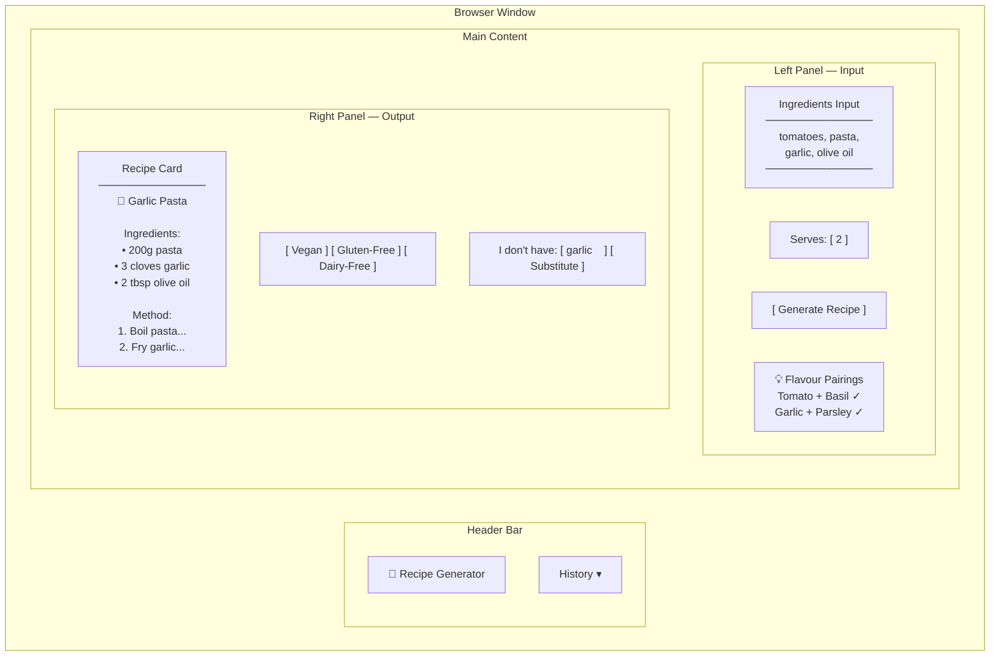
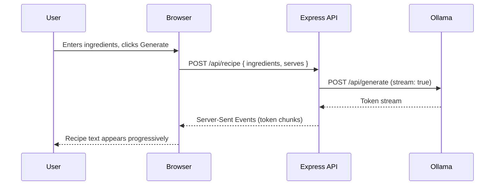
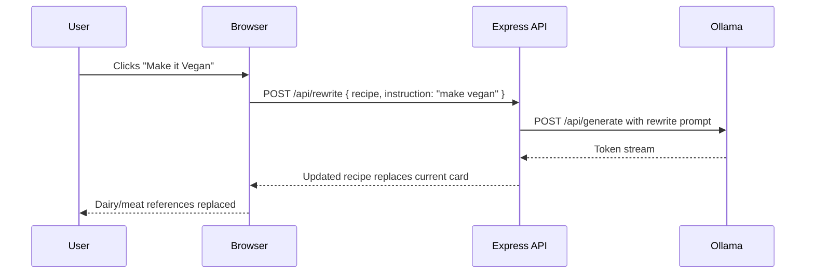
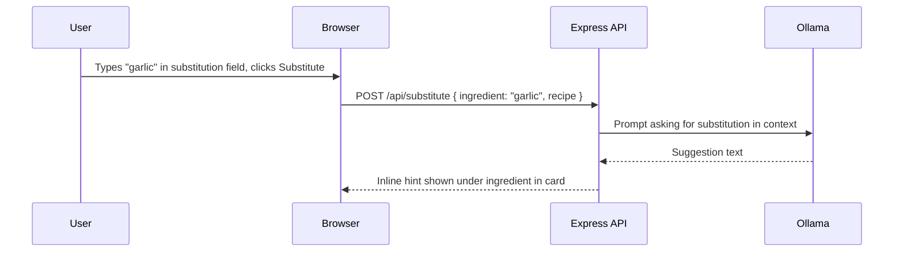
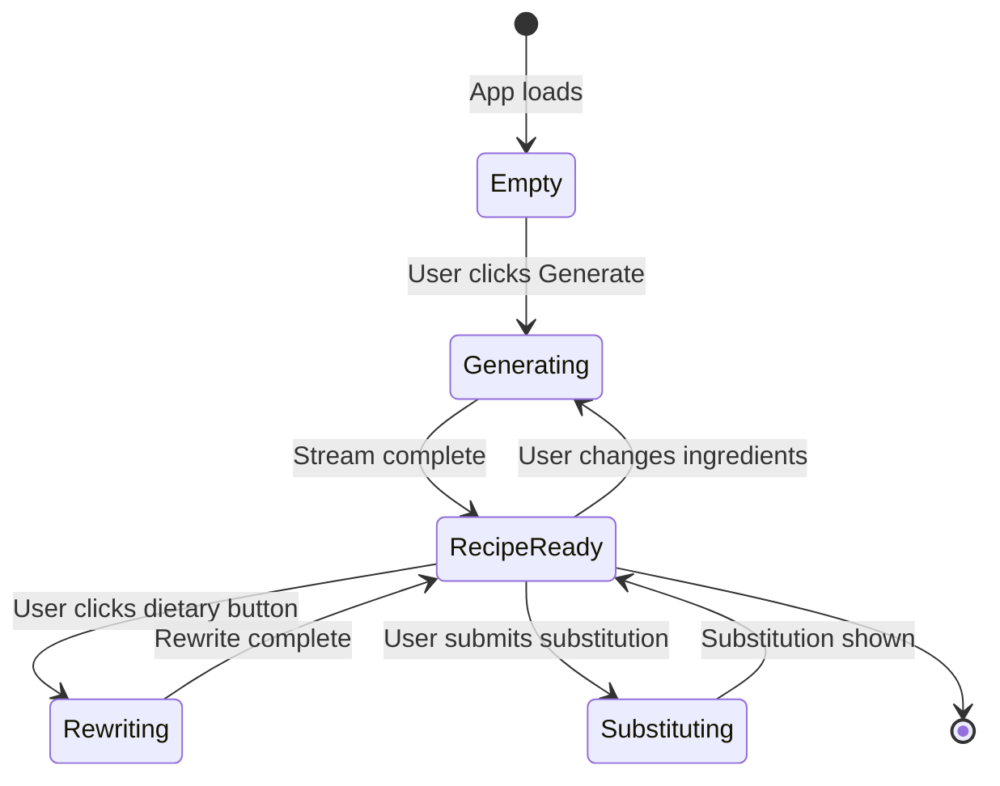
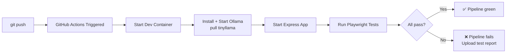
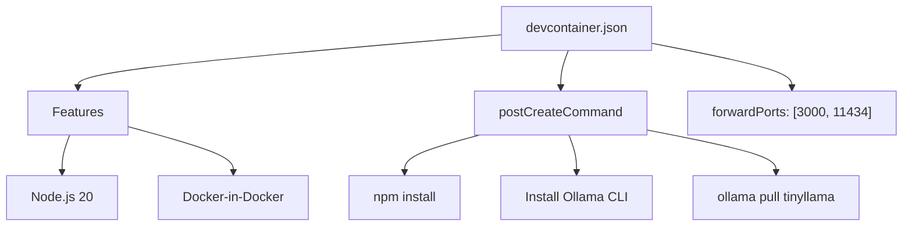

# Recipe Generator — Full Capabilities

A local-AI-powered recipe web app. Enter ingredients you have, get a full recipe back. Refine it with dietary options, substitutions, and serving adjustments — all powered by a local LLM via Ollama.

---

## Tech Stack

| Layer | Technology |
|---|---|
| Frontend | React + CSS |
| Backend | Node.js + Express |
| AI | Ollama (local LLM — `tinyllama` or `phi3.5`) |
| Tests | Playwright (E2E integration tests) |
| CI/CD | GitHub Actions |
| Dev Environment | Dev Container (Docker) |

---

## Features

### 1. Ingredient Input
- Free-text input field for entering available ingredients
- Comma-separated or line-by-line entry
- "Generate Recipe" button triggers AI call

### 2. Recipe Generation
- AI generates a full recipe based on entered ingredients
- Output includes: dish name, ingredients list with quantities, step-by-step method
- Streaming response (text appears progressively, not all at once)

### 3. Dietary Rewrite
- Buttons: **Make it Vegan**, **Make it Gluten-Free**, **Make it Dairy-Free**
- Sends current recipe back to the model with a rewrite instruction
- Recipe card updates in place

### 4. Ingredient Substitution
- "I don't have X" input below the generated recipe
- AI responds with a substitution suggestion in context of the current recipe
- Displayed as an inline hint beneath the relevant ingredient

### 5. Serving Adjuster
- Number input: "Serves" (default 2)
- On change, AI rescales all quantities in the recipe
- Quantities update in the ingredients list

### 6. Flavour Pairing Hints
- Before generating, a small panel shows flavour pairing suggestions for the entered ingredients
- Lightweight separate AI call, dismissible

### 7. Recipe History
- Previously generated recipes stored in `localStorage`
- Accessible via a side panel or dropdown
- Click to reload a past recipe

---

## Window Layout

### Main Application



### Streaming Response State



### Dietary Rewrite Flow



### Substitution Flow



---

## Page States



---

## GitHub Actions Pipeline



---

## Playwright Test Coverage

| Test | What it verifies |
|---|---|
| `recipe-generation.spec.ts` | Enter ingredients → recipe card appears with title and method |
| `streaming.spec.ts` | Text appears progressively (not all at once) |
| `dietary-rewrite.spec.ts` | Click Vegan → recipe no longer contains "butter" or "chicken" |
| `substitution.spec.ts` | Submit missing ingredient → inline hint appears |
| `serving-adjuster.spec.ts` | Change serves to 8 → quantities in card update |
| `history.spec.ts` | Generate two recipes → both appear in history panel |

---

## Dev Container Setup



---

## Folder Structure

```
RecipeGenerator/
├── .devcontainer/
│   └── devcontainer.json
├── .github/
│   └── workflows/
│       └── ci.yml
├── src/
│   ├── server/
│   │   ├── index.js          # Express app
│   │   └── routes/
│   │       ├── recipe.js     # POST /api/recipe
│   │       ├── rewrite.js    # POST /api/rewrite
│   │       └── substitute.js # POST /api/substitute
│   └── client/
│       ├── index.html
│       ├── app.js
│       └── style.css
├── tests/
│   ├── recipe-generation.spec.ts
│   ├── dietary-rewrite.spec.ts
│   ├── substitution.spec.ts
│   ├── serving-adjuster.spec.ts
│   └── history.spec.ts
├── CAPABILITIES.md
└── package.json
```
